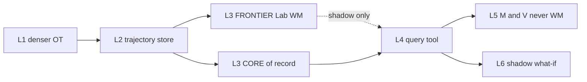

# How we use them

> **Lane:** FRONTIER. Companion to [README.md](README.md). Stack map source: [stamped-stack-hooks.md](../../maps/stamped-stack-hooks.md).  
> **Hard line:** L3 CORE, L5 M&V, and bill ₹ stay deterministic. WM outputs stay `lab_only` / `shadow_only` unless a future ADR promotes them.

World models are not one product feature. They are a **backend family**. Pick a mode, name the champion it must beat, and kill it if it cannot.

## Usage modes

Each row: what it is, which family, where it attaches, what “better” means, when to stop.

### 1. Prediction-error anomaly (default first try)

| | |
|--|--|
| **What** | If the model usually predicts the next plant state, a sudden large residual is a candidate anomaly (drift, sensor fault, process upset, OOD regime). |
| **Family** | RSSM / Dreamer residuals; JEPA latent-prediction error |
| **Hook** | L3 Lab challenger vs EWMA / CUSUM / SPC on TOW-P residuals |
| **Better means** | Higher precision@k or earlier drift catch on a labelled replay **without** raising false-positive rate vs residual SPC |
| **Kill if** | Cannot define an EE-trusted eval, or never beats residual SPC on drift in ≥2 plants ([PATHS](../../strategy/PATHS_FOR_STAMPED.md) gate B) |
| **Read** | [primer §3](../../concepts/00-world-models-primer.md) · [survey](../../concepts/01-world-models-survey-digest.md) |

### 2. Counterfactual / what-if

| | |
|--|--|
| **What** | Roll the latent simulator under a hypothetical setpoint, schedule, or weather day. Show the *shape* of the imagined trajectory. |
| **Family** | PlaNet / Dreamer imagination |
| **Hook** | L3 FRONTIER + [L6 counterfactual display stub](../../../handoff/l6/l6-counterfactual-display-stub.md) — **not** invoice ₹ |
| **Better means** | Plant EEs judge the imagined trajectory more useful than a static “if load were X” spreadsheet, and numbers that look like ₹ are never emitted |
| **Kill if** | Anyone treats dreams as setpoints or as M&V impact |
| **Read** | [PlaNet](../../papers/hafner-planet-2019.md) · [Dreamer](../../papers/hafner-dreamer-2020.md) · [ADR-013](../../../decisions/011-015/ADR-013-counterfactual-savings-ledger.md) (CORE ledger stays code) |

### 3. Plant transfer / cold-start

| | |
|--|--|
| **What** | Learn representations that transfer across plants so every new site is not “N specialized models forever.” |
| **Family** | JEPA, DinoWM, TimesFM / Chronos (cousin) |
| **Hook** | Per-plant baseline sprawl; L3 shadow bands during onboarding |
| **Better means** | Lower pinball / residual error in the first 30–90 days vs fleet priors + TOW-P alone, on ≥3 plants |
| **Kill if** | History per plant is too short/sparse, or transfer never beats seasonal-naive + LightGBM ([ADR-014](../../../decisions/011-015/ADR-014-ts-foundation-model-role.md) gates) |
| **Read** | [JEPA](../../concepts/02-jepa-and-leworldmodels.md) · [DinoWM](../../concepts/03-dinowm.md) · [competitor signal](../../maps/competitor-signal-notes.md) |

### 4. World model as an L4 query tool

| | |
|--|--|
| **What** | L4 stays a prose + tools agent over **deterministic** findings. A WM, if present, is a **tool the agent queries** (“what does the shadow model imagine if…?”). It does not choose actions or invent ₹. |
| **Family** | Dreamer / MuZero / TD-MPC **queried**, not acting |
| **Hook** | L4 tool over L3 findings; same veto / ranking / ₹ in code |
| **Better means** | Shadow explanations that operators actually use; zero numeric leakage into prescriptions |
| **Kill if** | The tool writes setpoints, bill numbers, or unbounded ReAct over OT |
| **Read** | [agents with WMs](../../concepts/04-agents-with-world-models.md) — do not merge the two meanings of “agent” |

### 5. Dense-sensing fusion (later)

| | |
|--|--|
| **What** | Richer observation (higher-res meters, selective multi-modal) so any backend — CORE or WM — sees more of the plant. |
| **Family** | V-JEPA / DINO / physical-AI *patterns* (not “become Gecko”) |
| **Hook** | L1 capture + L2 trajectory store |
| **Better means** | Model-ready trajectories without becoming a hardware company |
| **Kill if** | Densification cost >> modeled ₹ upside ([PATHS](../../strategy/PATHS_FOR_STAMPED.md) gate C) |
| **Read** | [physical AI](../../concepts/05-physical-ai-for-industry.md) · [data for the real world](../../concepts/08-data-for-the-real-world.md) |

### 6. Time-series foundation cousin (already allowed)

| | |
|--|--|
| **What** | TimesFM / Chronos are **not** world models. They are the shadow forecast lane we already decided. Use them as the cheap cousin baseline before standing up a Dreamer stack. |
| **Family** | TimesFM 2.x + XReg; Chronos |
| **Hook** | ADR-014 shadow challenger — never M&V / SEC / ₹ of record |
| **Better means** | Beats seasonal-naive **and** LightGBM on pinball across ≥3 plants; no FP regression; batch SLO |
| **Kill if** | Promotion gates fail — stay shadow; do not invent a new role |
| **Read** | [ADR-014](../../../decisions/011-015/ADR-014-ts-foundation-model-role.md) · [TimesFM note](../../papers/timesfm-google-2024.md) · [Chronos note](../../papers/chronos-amazon-2024.md) |

## Where they attach (L1–L6)

| Layer | Role today | FRONTIER hook | WM may |
|-------|------------|---------------|--------|
| **L1** | Connect OT / bills / edge | Denser sensing; selective multi-modal | Feed trajectories — not own the plant |
| **L2** | Timeseries + energy graph + features | Trajectory store; plant-state embeddings | Train / replay here |
| **L3 CORE** | TOW-P / SPC / LightGBM / rules → findings | **Unchanged as system of record** | **No** |
| **L3 FRONTIER / Lab** | TimesFM shadow; dual-lane Lab | Plant WM challenger; residual anomalies; counterfactual residuals | Yes — `lab_only` / `shadow_only` |
| **L4** | LangGraph / RAG / Rx prose | Query a WM tool; never invent ₹ | Query only |
| **L5** | Closure / verification / M&V | Work-as-done capture (Physical OS *method*) | **No** on claims or ₹ |
| **L6** | Experience | Shadow counterfactuals as explanations | Display only |

Bottlenecks a WM might attack (from [stack hooks](../../maps/stamped-stack-hooks.md)):

1. Per-plant baseline shift / transfer
2. Heterogeneity of sensor / process types
3. Counterfactuals without actuation
4. Anomaly as model surprise vs threshold soup

## CORE vs FRONTIER (do not merge)

| Job | Champion today | WM / FM role |
|-----|----------------|--------------|
| M&V baseline / SEC / bill ₹ | TOW-P + deterministic tariff | Never |
| MD exceedance forecast | LightGBM quantile | TimesFM shadow (ADR-014) |
| Anomaly bands | EWMA / CUSUM on TOW-P residuals | Residual-WM Lab challenger |
| Cold-start bands | Fleet hierarchical priors | TimesFM / JEPA shadow |
| Prescription prose | L4 templates + tools | WM as optional query tool |
| Verified savings | L5 + ADR-013 ledger | Never |

## Sequencing (from PATHS)

Default: **A (sharpen CORE) → (B world-model backend ∥ C denser data) → D floor closure → E wider KPIs.**

This pack is the brief for **B**, run in shadow beside A. It is not a license to starve CORE delivery or to pitch “world models run your bill.”
